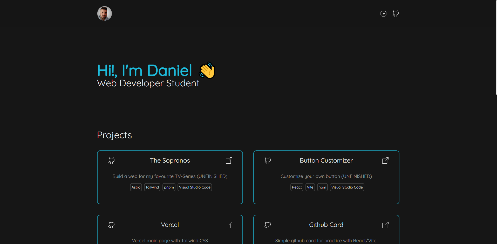

# My Portfolio

</img>

## 🚀 Project Structure

```
/
├── public/
│   └── assets/
├── src/
│   ├── components/
│   │   │── styles/
│   │   │── CardProject.astro   
│   │   │── CardTechnology.astro
│   │   │── CardTool.astro 
│   │   │── footer.astro
│   │   └── header.astro
│   ├── layouts/
│   │   └── Layout.astro
│   └── pages/
│       └── index.astro
│── package.json
└── tailwind.config.cjs
```

## 🧞 Commands

All commands are run from the root of the project, from a terminal:

| Command                   | Action                                           |
| :------------------------ | :----------------------------------------------- |
| `npm install`             | Installs dependencies                            |
| `npm run dev`             | Starts local dev server at `localhost:3000`      |
| `npm run build`           | Build your production site to `./dist/`          |
| `npm run preview`         | Preview your build locally, before deploying     |
| `npm run astro ...`       | Run CLI commands like `astro add`, `astro check` |
| `npm run astro -- --help` | Get help using the Astro CLI                     |

